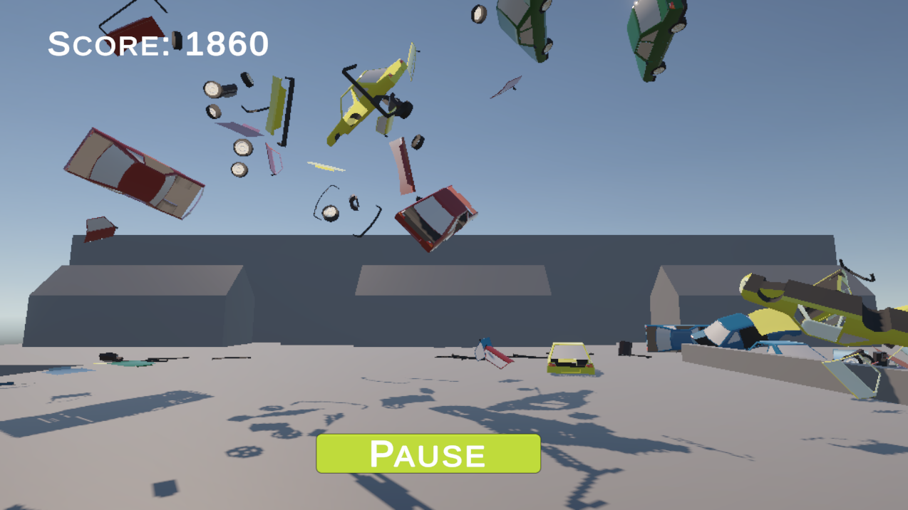

# Car Crasher

Ein 3D-Klickerspiel, entwickelt mit der Unity Engine. Zerstöre so viele Autos wie möglich, bevor sie den Boden erreichen, und erzile den ultimativen Highscore!

<a href ="https://alexpolygon.itch.io/car-crasher?secret=sdHGEHNdD0MYddULCKJU7hDpI2U"><b>Online Build auf itch.io</b></a>

## Screenshot

## 🛠️ Technische Details

* **Engine:** Unity
* **Sprache:** C#
* **Plattform:** WebGL

## 📜 Spielregeln & Punkte

* **Klicken zum Zerstören:** Ein Klick auf ein Auto zerstört es und bringt dir je nach Autofarbe **10 bis 40 Punkte**.
* **Kettenreaktion:** Wenn ein zerstörtes Auto in ein unbeschädigtes Auto krachte, löst du eine Combo aus und erhältst satte **100 Punkte**!
* **Pass auf den Boden auf:** Fällt ein Auto auf den Boden und zerbricht von selbst, erhältst du **0 Punkte**. Bleib wachsam und klicke schnell!
